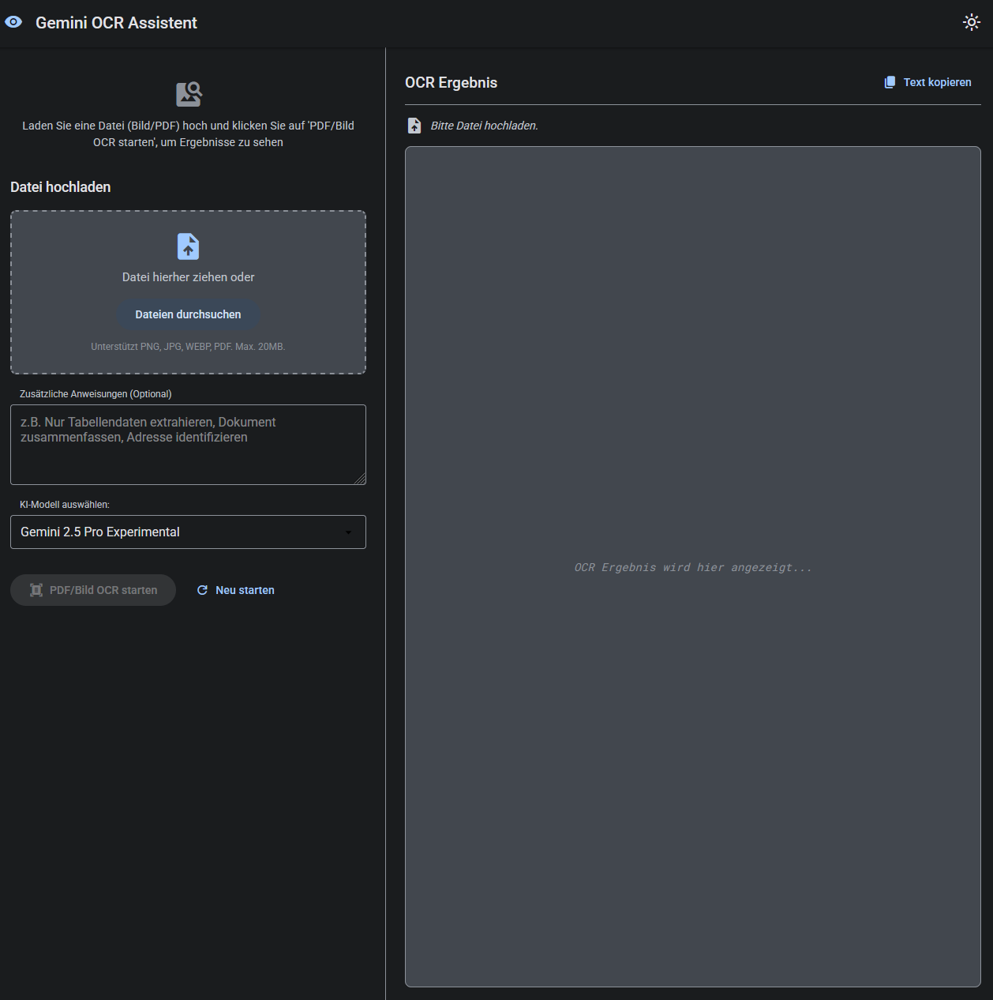

# Gemini OCR Chatbot 🚀

[](https://opensource.org/licenses/MIT) 

A simple yet powerful web-based Optical Character Recognition (OCR) chatbot for images and PDF files, leveraging Google's **Gemini 2.5 Pro Experimental** model (`gemini-2.5-pro-exp-03-25`). The application features a German user interface, streaming output for fast results, and was primarily developed through iterative prompting of an AI assistant (Gemini) – an example of "Vibe Coding"!

Currently, the necessary API keys can be obtained for free via [Google AI Studio](https://aistudio.google.com/).



## ✨ Features

*   **OCR for Images & PDFs:** Uploads common image formats (PNG, JPG, WEBP) and PDF files for text extraction.
*   **Gemini 2.5 Pro Power:** Utilizes the state-of-the-art `gemini-2.5-pro-exp-03-25` model for recognition.
*   **Streaming Output:** Displays extracted results incrementally as they are generated by the model.
*   **German UI:** User interface is presented entirely in German.
*   **Material Design Inspired:** Visual design follows Google's Material Design principles.
*   **Persistent Status Bar:** Clearly indicates the current state (Ready, Thinking, Writing, Done, Error) with a "wave" animation during thinking/writing phases.
*   **Dark/Light Mode:** Toggleable color scheme with persistence via Local Storage.
*   **Custom Instructions:** Ability to provide specific instructions to the model for the extraction process.
*   **File Preview:** Shows a thumbnail for images or an icon for PDFs.
*   **Secure:** Ignores the `.env` file containing the API key via `.gitignore`.

## 🛠️ Tech Stack

*   **Backend:** Python 3.x with Flask
*   **Frontend:** Vanilla HTML, CSS, JavaScript
*   **AI Model:** Google Gemini 2.5 Pro Experimental (`gemini-2.5-pro-exp-03-25`) via `google-generativeai` SDK
*   **Styling:** CSS inspired by Material Design

## ⚙️ Setup & Installation (Local)

Follow these steps to run the project locally:

1.  **Prerequisites:**
    *   Ensure [Python 3](https://www.python.org/downloads/) (typically 3.8 or higher) is installed.
    *   Ensure [Git](https://git-scm.com/downloads/) is installed.

2.  **Clone the Repository:**
    ```bash
    git clone https://github.com/marlonka/gemini-ocr-chatbot.git
    cd gemini-ocr-chatbot
    ```

3.  **Create a Virtual Environment (Recommended):**
    *   **Linux/macOS:**
        ```bash
        python3 -m venv venv
        source venv/bin/activate
        ```
    *   **Windows:**
        ```bash
        python -m venv venv
        .\venv\Scripts\activate
        ```

4.  **Install Dependencies:**
    ```bash
    pip install -r requirements.txt
    ```

5.  **Configure API Key (IMPORTANT!):**
    *   Create a file named `.env` in the project's root directory (`gemini-ocr-chatbot`).
    *   Add the following content, replacing `YOUR_API_KEY_HERE` with your actual API Key obtained from [Google AI Studio](https://aistudio.google.com/app/apikey):
        ```.env
        GOOGLE_API_KEY=YOUR_API_KEY_HERE
        ```
    *   **This file is ignored by `.gitignore` and should NEVER be committed or pushed to GitHub!**

6.  **Run the Flask Application:**
    ```bash
    flask run
    # Or: python app.py
    ```

7.  **Open the Application in your Browser:**
    *   Navigate to `http://127.0.0.1:5000` (or the address shown in your terminal).

## 🚀 Usage

1.  Open the web interface in your browser.
2.  Drag & drop an image or PDF file onto the dropzone, or click "Dateien durchsuchen" (Browse files) to select one.
3.  (Optional) Enter specific instructions in the text area (e.g., "Extract only the table on page 2").
4.  Click "PDF/Bild OCR starten" (Start PDF/Image OCR).
5.  Observe the status bar ("KI denkt nach..." -> "Die KI schreibt...") and the results streaming into the right panel.
6.  Click "Text kopieren" (Copy Text) to copy the result to your clipboard.
7.  Click "Neu starten" (Start New) to upload a different file.
8.  Use the icon in the top-right corner to toggle between light and dark modes.

## 💡 Development Note

This project was significantly developed using AI prompting (specifically Google Gemini). It served as an experiment to explore the extent to which precise instructions given to an advanced AI could build a functional web application. The process involved approximately 8-10 iterative main prompts to implement features like PDF support, streaming, UI adjustments, and bug fixes.

## �� Contributing

Contributions are welcome! If you have suggestions or find bugs, please open an issue or submit a pull request.

## �� License

This project is licensed under the MIT License. 